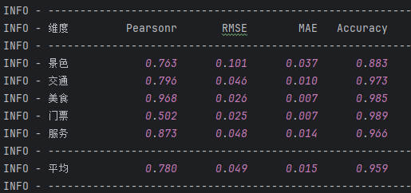
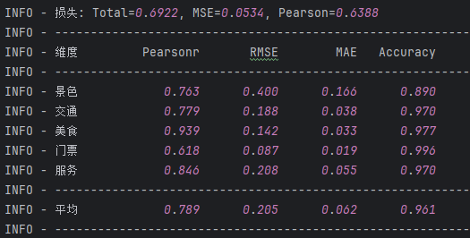
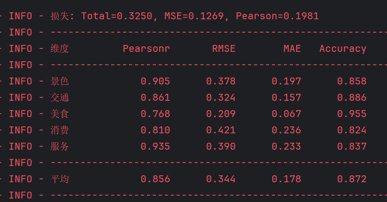
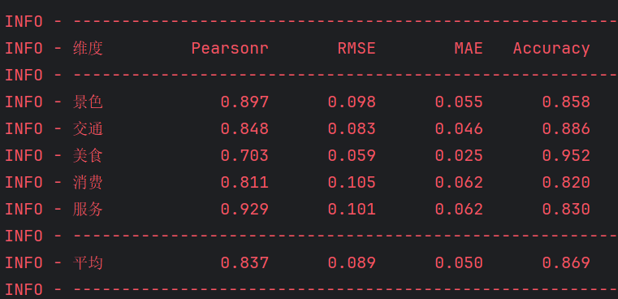
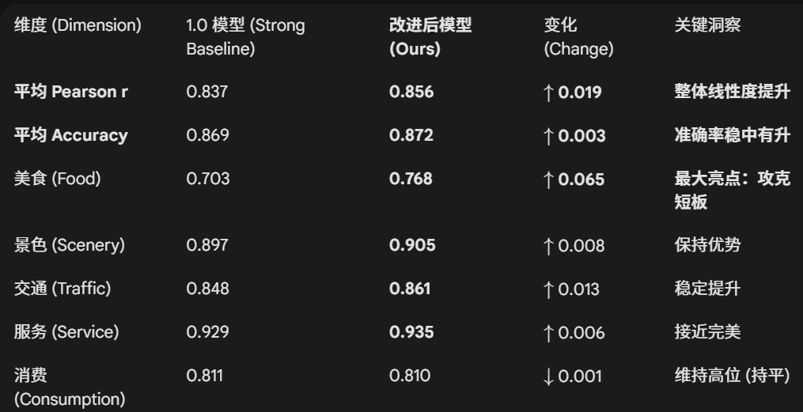

# 内容说明
## m1为数据清洗模块
使用excel文件进行数据清洗，将清洗后的数据保存为json文件
## m2为蒸馏式标注模块
## m3为数据集封装模块
## m4为模型训练模块
选取最优基础模型为robert，其结果如下

## m4_text为模型测试模块
配置文件对应为m4_b_config.py
## m5为使用模型进行全面标注
# 2025.12.12（删除输出部分激活函数，记为2.0版本）
1.更新了损失函数结构
Loss = α * MSE + β * (1 - Pearson_r)
2.删除了模型框架结尾的激活函数，解决无法到达边界的问题
训练结果如下

# 发现逻辑问题（已更正1.0版本与2.0版本）
经过检查发现，当出现断点重续时，比对的最佳模型为，断点的参数，
而不是实际的最佳模型参数，导致模型性能不是最佳性能
# 2025.12.13（新数据集）
1.使用新数据集进行训练，训练结果如下：
### 2.0模型

### 1.0模型

## 结果比对

# 2025.12.15(实验一全流程替换为sql版本)
新数据集已跑完全流程，