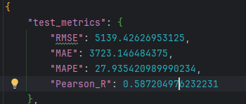

# 内容说明
## m1为数据清洗模块（改）
使用excel文件进行数据清洗，将清洗后的数据保存为json文件
## m2为蒸馏式标注模块
## m3为数据集封装模块
## m4为模型训练模块
选取最优基础模型为robert，其结果如下

## m4_text为模型测试模块
配置文件对应为m4_b_config.py
## m5为使用模型进行全面标注（改）
# 2025.12.12（删除输出部分激活函数，记为2.0版本）
1.更新了损失函数结构
Loss = α * MSE + β * (1 - Pearson_r)
2.删除了模型框架结尾的激活函数，解决无法到达边界的问题
训练结果如下

# 发现逻辑问题（已更正1.0版本与2.0版本）
经过检查发现，当出现断点重续时，比对的最佳模型为，断点的参数，
而不是实际的最佳模型参数，导致模型性能不是最佳性能
# 2025.12.13（新数据集）
1.使用新数据集进行训练，训练结果如下：
### 2.0模型

### 1.0模型

## 结果比对

# 2025.12.15(实验一全流程替换为sql版本)
新数据集已跑完全流程，
# 2025.12.17（实验二）
## 构建m6模块，
其主要作用是聚合客流数据，聚合每日客流天气，节假日
## 构建m7模块（改）
其主要作用是融合情感数据与物理数据，并构建特征工程
## 构建m8模块
其主要作用是构建数据集，并保存为.npy文件
# 2025.12.18（发现报错）
## m8模块构建出现nan，检查逻辑并重构代码（还未解决）
考虑重构代码，并增加csv输出可视化检查数据输出质量
# 2025.12.20(彻底解决数据集报错问题，开始重构数据集)
## m8模块重构
### ——命名为m8a——中文数据映射和数据处理
###  ——命名为m8b——构建数据集
# 2025.12.22（开始训练模型）
## 模型1.0版本训练结果

### 原因分析
1.在模型寻来你第二阶段，出现死线，rmse在3996.19xx保持不变模型停止学习 
可能是完全锁死的主干网络导致的loss剧烈波动，引起了优化器屏蔽特征
### 解决方案
尝试使用差分学习率，即在二阶段，给予权重网络正常学习率，而给予骨干网络原学习率的1/10或1/100，避免loss波动锁死
降低正则化系数，从1e-4降到1e-5，给权重网络更多调整空间
# 2025.12.24(flash模型调整)
发现模型过大而数据集过小，导致模型过拟合，将整个模型精简，参数量由原来的2,626,637（260万）精简到206,157（20万）
# 发现数据集错误！！！
之前数据集的构建和特征工程，存在巨大问题，大量历史数据缺失
另更改实验，采用小时级数据，制作数据流程
## 做以下修改
1. 重新修订了23年舆情数据填充替换了匹配内容规则，重新整理数据库内容
2. 新的23响沙湾舆情匹配数据有：  567,958 （原：530,046）
3. 新的23鄂尔多斯草原匹配数据有：158,566 （原：141,747）
4. 新的24舆情数据有：          563,238 （原：556,251）
5. 新的清洗后数据库yq_clean_all_2有：  1,289,762 （原：1,228,042）
6. 重新使用m4b模块，标注新的m4_sql_b_inference_2表
## 重要修改！！修改m5模块，将原先的平均值聚合方式，引入贝叶斯平滑

### 计算 K 值字典：
在聚合之前，先分析原始数据。
对于每一个 dimension（景色、美食等），计算该维度下每日评论条数 (count) 的 25% 分位数 (quantile 0.25)。
将这个值向下取整，作为该维度的 $K$ 值。兜底策略： 如果某维度的 25% 分位数小于 1，则强制设 $K=1$。
打印出每个维度计算得到的 $K$ 值,并保存为 JSON 文件——k_values.json

### 结果
【响沙湾】
  K值参数: {'景色': 118, '交通': 8, '美食': 11, '消费': 13, '服务': 13}
  记录统计: 总 1,033,158 | 有效 1,033,158
  日期覆盖: 774 天有数据 / 774 总天数

【鄂尔多斯草原】
  K值参数: {'景色': 30, '交通': 2, '美食': 4, '消费': 4, '服务': 4}
  记录统计: 总 256,604 | 有效 256,604
  日期覆盖: 774 天有数据 / 774 总天数
# 2025.12.25
## m7模块代码重构
原先的切片方案，会导致失去失去数据集前七天数据，均值填充无法得到七天均值数据
现在采用周期性回填，选用下一年国庆数据来填充数据集前七天特征，最大化保留第一年的滞后特征
## m8a模块代码重构
1. 增加月份这一特征，使用周期性编码
2. 将原先的星期特征，改为周期性编码
3. 对于原先的节假日编码，保持不变仍使用01区分
4. 增加工作特征，使用chinesecalendar 库是处理中国复杂的“调休/补班”，区分休息（包括假期和周末）工作（工作日和调休）
# 2025.12.26(m10模型重构)
1. 调整模型训练方式，彻底放弃三段式训练模式
2. 更换损失函数为ccc，并考虑加权mse
3. 优化lpearson r计算方式，现不以整个批次进行衡量，而是每个样本单独衡量，累计计算
4. 调整m9模型的动态网络激活函数，由softmax替换为Tanh 激活，增加情感权重